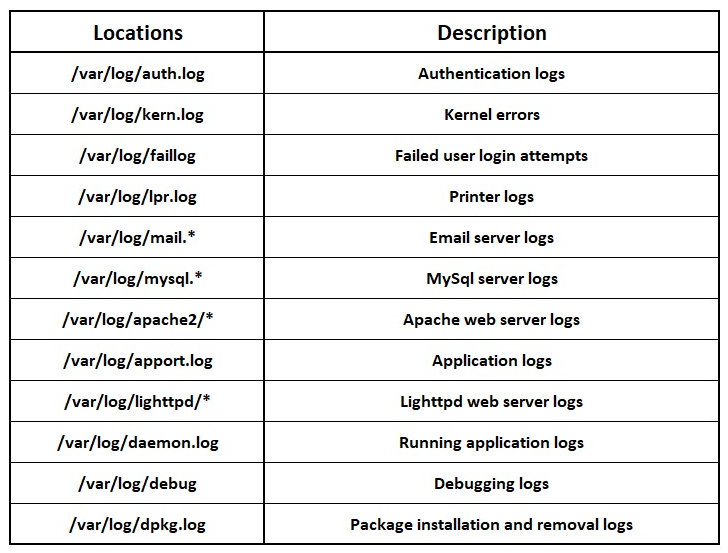

Chapter 12: Logging and Log Security

## Table of content
- [Table of content](#table-of-content)
- [Linux system log files](#linux-system-log-files)
- [rsylog](#rsylog)
- [journald](#journald)
- [Logwatch](#logwatch)

## Linux system log files

- In the `/var/log` directory
  - On Red Hat-type system:
    - Main log file is the message files
    - Authentication-related events is the `secure` file
  - On Debian-type system:
    - Main log file is the `syslog` file
    - Authentication log is the `auth.log` file
  - `/var/log/kern.log`: On Debian system, it contains messages about what's going on with the Linux kernel.
  - `/var/log/wtmp` and `/var/run/utmp` : Record information about users who are logged in to te system. `wtmp` hold historical data from `utmp`
  - `/var/log/btmp`: Information about failed login attemps
  - `/var/log/lastlog`: Last time users logged in to the system
  - `/var/log/audit/audit.log`: Information from the audited daemon.

- The system log and the authentication log: 
  - Have the same basic structure and are all plaintext files.   
  - Ways to obtain specific information from the log files:
    - utility: `grep`, `less`
    - Writing scripts in languages: `bash`, `Python`, `awk`
- The utmp, wtmp, btmp, and lastlog files:
  - Binary files
  - Tools to extract information from them:
    - `w` and `who` : pull information about who's logged in and what they're doing from the `/var/run/utmp` file.
    - `last` command pulls information from the `/var/log/wtmp` file.
    - `lastlog` command: pulls information from `/var/log/lastlog` file => show record of all users on the machine and when they logged in last

## rsylog

- A traditional, centralized logging system that has been used in Linux distributions for many years
- A high-performance syslog implementation that provides a centralized logging infrastructure for many Linux-based systems
- Can forwarding log messages to remote servers, filtering and sorting logs, and archiving logs.
- rsyslog logging rules
  - Define where to record messages for each particular system service:
    - On RedHat/CentOS systems, rules are stored in the `/etc/rsyslog.conf`
    - On Debian/Ubuntu systems, the rules are in separate files in the `/etc/rsyslog.d/` directory. The main file that we care is `deault.conf` file (contains the main logging rules)

## journald

- A newer, system-wide logging system introduced in the systemd init system
- Use the systemd ecosystem
- Journald sent messages to binary files
- Provides more advanced features
  - Filtering logs based on fields
  - Storing metadata alongside log entries
  - Tracking process and service status changes.
- Use `journalct` utility to extract information
- Journald log files will clear after reboot

## Logwatch

- Help to daily log review easily
- Set up (Ubuntu):
  - Install `Logwatch`
  - Create a mail spool file
        > sudo touch /var/mail/<your_user_name>
  - Forward the root user's mail to your own normal account by add line to file `/etc/aliases`
        > root:     your_user_name
  - Save the file and let the system can read it:
        > sudo newaliases
  - See default configuration file of `Logwatch`:
        > less /usr/share/logwatch/default.conf/logwatch.conf
  - Change the configuration by edit `/etc/logwatch/conf/logwatch.conf`:
  - And in the next morning, we can view our log summary with `mutt`
  

