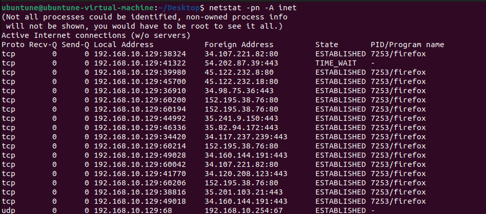
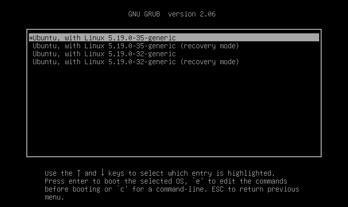
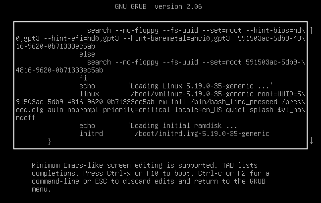

Chapter 14: Security Tips and Tricks for the Busy Bee

## Table of content
- [Table of content](#table-of-content)
- [Auditing system services](#auditing-system-services)
  - [Hands-on lab – viewing network services with netstat](#hands-on-lab--viewing-network-services-with-netstat)
- [Password protecting the GRUB 2 bootloader](#password-protecting-the-grub-2-bootloader)
  - [Hands-on lab – resetting the password for Ubuntu](#hands-on-lab--resetting-the-password-for-ubuntu)
  - [Preventing kernel parameters edits on Ubuntu](#preventing-kernel-parameters-edits-on-ubuntu)
  - [Password protecting boot options](#password-protecting-boot-options)
- [Security checklist for system setup](#security-checklist-for-system-setup)

Code files of this chapter : https://github.com/PacktPublishing/Mastering-Linux-Security-and-Hardening-Second-Edition

## Auditing system services

- A basic tenet of server administration that is never have anything that you don't absolutely need installed on a server => Some ways to audit your system to ensure that no unnecessary network services are running on it
  - Auditing system service with systemctl
    - Show status of services are running on the system
        > sudo systemctl -t service --state=active
  - Auditing network services with netstat
    - Why need to keep track of what network services are running on your system:
      - Ensure that no legitimate network services that     you don't need are running
      - Ensure that you don't have any malware that's listening for network connections from its
  - Auditing network services with Nmap
    - Can give you lots of good information about what's going on with your network services.
    - You have to log in to every individual host on your network to use it.
    - Port states
      - Filtered : is blocked by firewall
      - Open : is not blocked and running
      - Closed : is not blocked but not running
    - Scan types
      - TCP connect Scan
      - SYN Scan
      - UDP Scan
      - ...

### Hands-on lab – viewing network services with netstat
- View the list of established connections:
    > netstat -pn -A inet
      
- View again after open a browser
      
- Connect ssh from host to vm and view esablished connections again:
      

## Password protecting the GRUB 2 bootloader

- **Grand Unified Bootloader (GRUB)**: prevent a thief from booting into emergency mode to do the password reset.
  - With the old-style legacy GRUB, you could prevent people from editing kernel parameters. 
  - With GRUB 2, we can choose which users you want to be able to boot from any particular operating system.
  
### Hands-on lab – resetting the password for Ubuntu

  
- Use `passwd` to change password
    

### Preventing kernel parameters edits on Ubuntu
  - GRUB 2 configuration files: `/etc/grub.d/`
  - `grub-mkpasswd-pbkdf2` utility
    - generate hashed passwords for use with the GRUB loader, using the Password-Based Key Derivation Function 2 (PBKDF2) algorithm
        
  - Add line to `/etc/grub.d/40_custom`
    - 
  - Create a new grub.cfg
      > sudo update-grub
  And now after reboot, this prevent anyone execpt the superuser from editing the kernel parameters

### Password protecting boot options 

- Two boot options:
    - Boot normally
    - Boot into recovery mode
  - When update operating system, Red Hat-type and Ubuntu-type OS install the new kernel along with the old kernel but not overwrite the old one
    - Delete the old kernels with `sudo apt autoremove`
  - If you have a dual-boot or a multi-boot configuration, and want only certain users to use certain boot options, this technique will help you.
  
- Disabling the submenu for Ubuntu
  - Placing `GRUB_DISABLE_SUBMENU=true` in `/etc/default/grub` file and run `sudo update-grub`
  => after reboot, we will see list of boot options instead of just the default boot option and a submenu

- Password protecting boot option steps

## Security checklist for system setup
