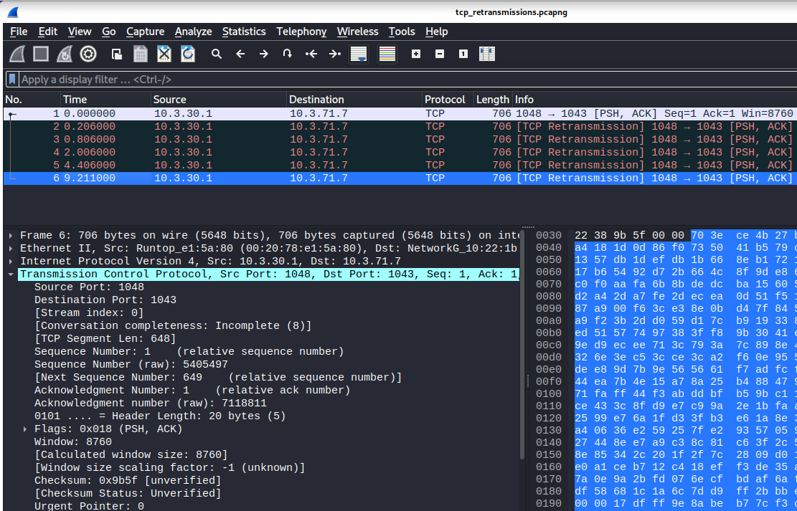
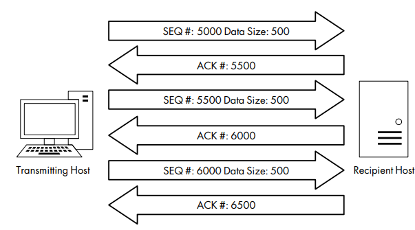
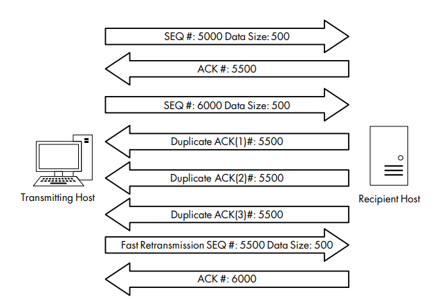
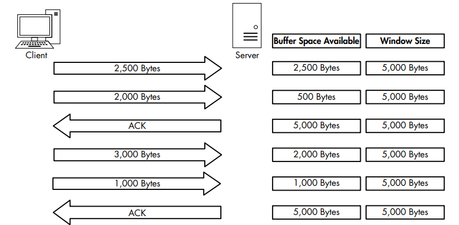
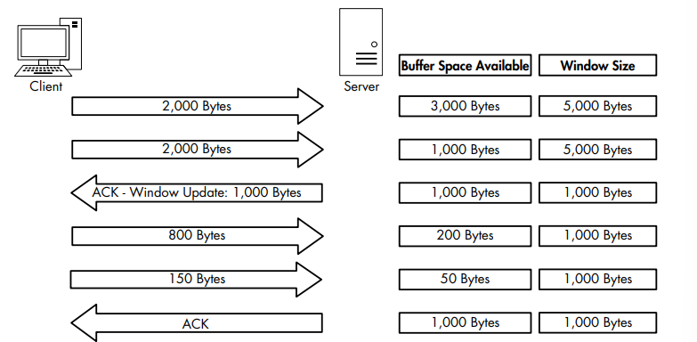
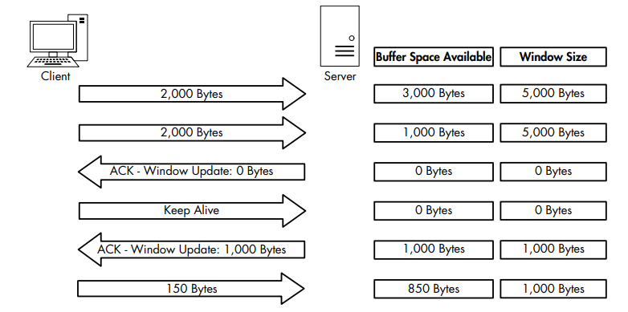

# Chapter 9: Fighting a Slow Network

## Table of content
- [Chapter 9: Fighting a Slow Network](#chapter-9-fighting-a-slow-network)
  - [Table of content](#table-of-content)
  - [TCP Error-Recovery Features](#tcp-error-recovery-features)
  - [TCP Flow Control](#tcp-flow-control)
  - [Learning from TCP Error-Control and Flow-Control Packets](#learning-from-tcp-error-control-and-flow-control-packets)
  - [Locating the Source of High Latency](#locating-the-source-of-high-latency)
  - [Netwwork Baselining](#netwwork-baselining)

This chapter will help us better equipped to identify, diagnose, and troubleshoot slow networks.

## TCP Error-Recovery Features

- `latency`: delay between a packet's transmission and its receipt, can be measures as:
  - One-way: from a single source to a destination
  - Round-trip: from a source to a destination and back to the original source

- TCP Retransmissions:
  - This is one of TCP’s most fundamental error-recovery features to avoid packet loss
  
  
  - Causes of packet loss:
    - Malfunctioning applications
    - Routers under a heavy traffic load
    - Temporary service outage

- TCP Duplicate Acknowledgments and Fast Retransmissions
  - A duplicate ACK is a TCP packet sent from a recipient when that recipient receives packets that are out of order.
  - Use the sequence and acknowledgment number fields to ensure that data is received and reassembled in the same order.
      > Sequence Number In + Bytes of Data Received = Acknowledgment Number Out
    
  
  
  
  
## TCP Flow Control

- A sliding-window mechanism to detect when packet loss
may occur and adjust the rate of data transmission to prevent this. The sliding-window mechanism leverages the data recipient’s receive window to control the flow of data.
  - The receive window is a value specified by the data recipient and stored in the TCP header (in bytes).
  - The transmitting host can send only the amount of data specified in the Window size value field at one time. If it sent over, the recipient must send an acknowledgment that the previous data was received.

- Adjusting the Window size:
  - When a server becomes too busy to process data at the rate its receive window is advertising, it can adjust the size of the window.
    - Decreasing the window size value in the TCP
      header of the ACK packet it is sending back to the hosts that are sending it data
  

- Halting data Flow with a Zero Window Notification:
  - When server have problem and can't process data sent from a client, it can halting dataflow by sends a packet with the Window size value field set to 0.

## Learning from TCP Error-Control and Flow-Control Packets

- Some notes to keep in mind when troubleshooting latency issues:
  - Retransmission packets:
    - Occur when the client has detected that the server
is not receiving the data it’s sending. 
    - Depending on which side of the communication you are analyzing, we will never see transmissions (ex capturing data from the server-side)
  - Duplicate ACK packets:
    - As the pseudo-opposite of a retransmission, because it is sent when the server detects that a packet from
    the client it is communicating with was lost in transit
  - Zero window and keep-alive packetsP:
    - Relates directly to the server’s inability to receive
and process data

## Locating the Source of High Latency

- In cases that the slowness doesn’t show the common symptoms of TCP retransmissions or duplicate ACKs, we need another technique to locate the source of the
high latency:
    - Examine the initial connection handshake and the first couple of packets that follow it.

- Normal Communications: 
  
- Slow Communications:
  - Wire Latency:
    - We can see packet 2 and 5 have high latency
    - It is wire latency because
      - Not doing any processing beyond simply receiving the SYN/ACK packet -> not client latency
      - Even when a server is experiencing a very heavy traffic load, it will typically respond quickly to a SYN packet with a SYN/ACK => not server latency
      
  - Client Latency:
    - Examine what is occurring between packets 3 and 4
      - Packet 3 is the final ACK in the TCP handshake sent from the client to the server
      - Packet 4 is the GET request sent from the client to the server
  - Server Latency

- Latency Locating Framework 

## Netwwork Baselining

- Site Baseline
- Host Baseline
- Application Baseline

- Additional Notes