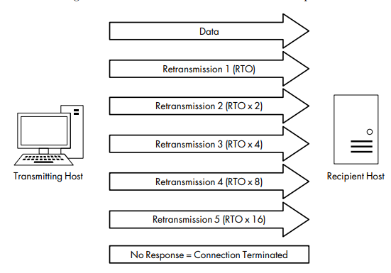

# Chapter 9: Fighting a Slow Network

## Table of content
- [Chapter 9: Fighting a Slow Network](#chapter-9-fighting-a-slow-network)
  - [Table of content](#table-of-content)
  - [TCP Error-Recovery Features](#tcp-error-recovery-features)
  - [TCP Flow Control](#tcp-flow-control)
  - [Learning from TCP Error-Control and Flow-Control Packets](#learning-from-tcp-error-control-and-flow-control-packets)
  - [Locating the Source of High Latency](#locating-the-source-of-high-latency)
  - [Netwwork Baselining](#netwwork-baselining)

This chapter will help us better equipped to identify, diagnose, and troubleshoot slow networks.

## TCP Error-Recovery Features

- `latency`: delay between a packet's transmission and its receipt, can be measures as:
  - One-way: from a single source to a destination
  - Round-trip: from a source to a destination and back to the original source

- TCP Retransmissions:
  - This is one of TCP’s most fundamental error-recovery features
    - Retransmission timeout (RTO) is average of round-trip
time (RTT)
  
  - Causes of packet loss:
    - Malfunctioning applications
    - Routers under a heavy traffic load
    - Temporary service outage

- TCP Duplicate Acknowledgments and Fast Retransmissions

## TCP Flow Control

- A sliding-window mechanism to detect when packet loss
may occur and adjust the rate of data transmission to prevent this.

- Adjusting the Window size
- Halting data Flow with a Zero Window Notification
- The TCP Sliding Window in Practice

## Learning from TCP Error-Control and Flow-Control Packets

- Some notes to keep in mind when troubleshooting latency issues:
  - Retransmission packets
  - Duplicate ACK packets
  - Zero window and keep-alive packets

## Locating the Source of High Latency

- In cases that the slowness doesn’t show the common symptoms of TCP retransmissions or duplicate ACKs, we need another technique to locate the source of the
high latency:
    - Examine the initial connection handshake and the first couple of packets that follow it.

- Normal Communications 

- Slow Communications:
  - Wire Latency
  - Client Latency
  - Server Latency

- Latency Locating Framework 

## Netwwork Baselining

- Site Baseline
- Host Baseline
- Application Baseline

- Additional Notes