## Table of contents

- [Table of contents](#table-of-contents)
- [The Registry](#the-registry)
- [Viewing and changing the registry](#viewing-and-changing-the-registry)
- [Registry usage](#registry-usage)
- [Registry data type](#registry-data-type)
- [Registry logical structure](#registry-logical-structure)
  - [HKEY\_CURRENT\_USER](#hkey_current_user)
  - [HKEY\_USERS](#hkey_users)
  - [HKEY\_CLASSES\_ROOT](#hkey_classes_root)
  - [HKEY\_LOCAL\_MACHINE](#hkey_local_machine)
  - [HKEY\_CURRENT\_CONFIG](#hkey_current_config)
  - [HKEY\_PERFORMANCE\_DATA and HKEY\_PERFORMANCE\_TEXT](#hkey_performance_data-and-hkey_performance_text)
- [Application hives](#application-hives)
- [Transactional Registry (TxR)](#transactional-registry-txr)
- [Monitoring registry activity](#monitoring-registry-activity)
- [Process monitor internals](#process-monitor-internals)
- [Registry Internal](#registry-internal)
  - [Hives](#hives)
  - [Hive size limits](#hive-size-limits)
  - [Startup and the registry process](#startup-and-the-registry-process)
  - [Registry symbolic links](#registry-symbolic-links)
  - [Hive structure](#hive-structure)
  - [Cell maps](#cell-maps)
- [Hive reorganization](#hive-reorganization)
- [The registry namespace and operation](#the-registry-namespace-and-operation)
- [Stable storage](#stable-storage)
  - [Incremental logging](#incremental-logging)
- [Registry filtering](#registry-filtering)
- [Registry virtualization](#registry-virtualization)
- [Registry optimizations](#registry-optimizations)
- [Some demo](#some-demo)

-----------

## The Registry

- It is the repository
for both systemwide and per-user settings --> plays a key role in the configuration and control of Windows systems

## Viewing and changing the registry

- `Regedit.exe` : main GUI tool for editing the registry.
- `Reg.exe` : can import, export, back up, and restore keys, as well as to compare, modify, and delete keys and values. It can also set or query flags used in UAC virtualization
- `Regini.exe` : allows you to import registry data based on text files that contain ASCII or Unicode configuration data.
- `Offreg.dll` (from WDK): Host the Offline Registry Library, this library allows loading registry key hive files in their binary format and applying operations on the files themselves, bypassing the usual logical loading and mapping that Windows requires for registry operations

## Registry usage

- When is it read?
    - During the initial boot process
    - During the kernel boot process
    - During logon, Explorer and other Windows components read per-user preferences
    - During applications startups.
- When is it modified?
    - During the installation of a device driver
    - Application setup utilities create default application settings
    - When you change application or system settings through user interface.
    - Many default settings are defined by a prototype version of the registry that ships on the Windows setup media.

## Registry data type

- Contain:
    - `keys` : consist of other keys (subkeys or values)
    - `values` : store data

## Registry logical structure

> Note: H in root key means Windows Handle Key

### HKEY_CURRENT_USER 
- Contains data regarding the preferences and software       configuration of the locally
logged-on user

### HKEY_USERS
- Contains subkeys for all loaded user profiles

### HKEY_CLASSES_ROOT
- Contains file association and COM registration information
- Consist of three types of information: 
  - File extension associations.
  - COM class registrations.
  - The Virtualized registry root for User Account Control (UAC) 
- Data under HKCR comes from two sources:
  - The per-user class registration data in HKCU\SOFTWARE\Classes (mapped to the file on hard
disk \Users\<username>\AppData\Local\Microsoft\Windows\Usrclass.dat)
  - Systemwide class registration data in HKLM\SOFTWARE\Classes

###  HKEY_LOCAL_MACHINE
- Global settings for the machine
- Contains all the systemwide configuration subkeys:
  - `BCD00000000` :  Boot Configuration Database (BCD) information. BCDEdit command-line utility allows you to modify the BCD using symbolic names for the elements and objects
  - `COMPONENTS` :  information pertinent to the Component-Based
Servicing (CBS) stack (this stack contains various files and resources that are part of a Windows installation image)
  - `HARDWARE` : descriptions of the system’s legacy hardware and some  hardware device-to-driver mappings
  - `SAM`(Security Account Manager) : holds local account and group information, such as user passwords, group definitions, and domain associations.
  - `SECURITY` : stores systemwide security policies and user-rights assignments
  - `SOFTWARE` : stores systemwide configuration information not needed to boot the system, paths to application files and directories, and licensing and expiration date information of third-party applications.
  - `SYSTEM` : contains the systemwide configuration information needed to boot the system (which device drivers to load and which services to start)

### HKEY_CURRENT_CONFIG

- Current hardware profile
- Stored under HKLM\SYSTEM\
CurrentControlSet\Hardware Profiles\Current
- Exists to support legacy applications that might depend on its presence
  
### HKEY_PERFORMANCE_DATA and HKEY_PERFORMANCE_TEXT
- Both registry keys are the mechanism used to access performance counter values on Windows. 
- HKEY_PERFORMANCE_DATA:
  - Contains actual system performance data: processor usage, memory usage, and disk activity,..
  - Can't see in **Registry Editor**
  - Available only through the Windows registry functions (ex *RegQueryValueEx).
- HKEY_PERFORMANCE_TEXT:
  - A subkey of HKEY_LOCAL_MACHINE\SOFTWARE\Microsoft\Windows NT\CurrentVersion\Perflib
  - Contains the text strings used to display the performance data in a human-readable format.
  -
   
- We also can use `Performance Data Helper (PDH)` to 
  

## Application hives

- An application hive is a standard hive file (which is linked to the proper log files) that can be mounted visible only to the application that requested it.
- Developer can create a base file by using RegSaveKeyEx API, then the application mount the hive privately using RegLoadAppKey function
- The application can use standard registry APIs to read and write its own settings, which will be stored in the application hive.
- The Application hive will be automatically unloaded when the application exits or when the last handle to the key is closed.
- Application hives are use by different Windows component:
  - Application Compatibility telemetry agent (CompatTelRunner.exe):
    - Runs in the background and collect information about software compatibility issues 
  - The Modern Application Model (MAM) : 
    - a framework built on top of the Universal Windows Platform (UWP), use for developing and deploying modern apps on Windows operating system. 

## Transactional Registry (TxR)

- `Kernel Transaction Manager (KTM)` : By access to a straightforward API, it help people implement a robust error-recovery capabilities when performing registry operations.
- Three APIs support transactional modification of the Registry:
  - *RegCreateKeyTransacted*
  - *RegOpenKeyTransacted*
  - *RegDeleteKeyTransacted* : to ensure that the deletion of subkeys is also included in a transaction and is therefore rolled back if the transaction is rolled back.
- Data for these transacted operations is written to log files using `Common logging file system (CLFS)` services.
- Transactions are isolated from each other, and the isolation level implemented by TxR resource managers is read-commit.
- To make permanent changes to the registry, the applications use the transaction handle must call *CommitTransaction*
- The TxR stores its own internal log files in %SystemRoot%\System32\Config\Txr folder on the system volume.
- `Resource Manager (RM)`
  - Services all the hives mounted at boot time. For every hive that is mounted explicitly, an RM is created
  - The internal log files used by the RM are stored in the %SystemRoot%\System32\Config\Txr folder on the system volume, with a .regtrans-ms extension

## Monitoring registry activity
- It’s virtually impossible to know what registry keys or values are misconfigured without understanding how the system or the application that’s failing is accessing the registry. 
- Use Process Monitor to monitor registry activity as it occurs. It shows the process that performed the access, the time, type, and result of the access; and the stack of the thread at the moment. 

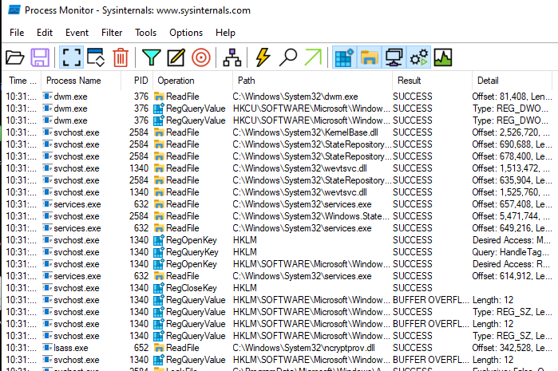

## Process monitor internals

EXPERIMENT: Viewing registry activity on an idle system

EXPERIMENT: Using Process Monitor to locate application registry settings
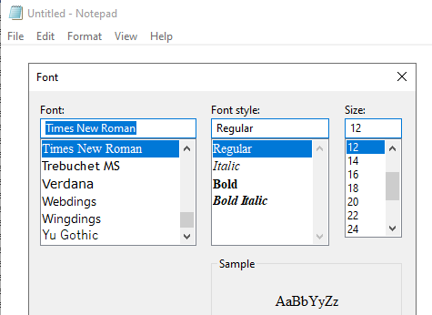
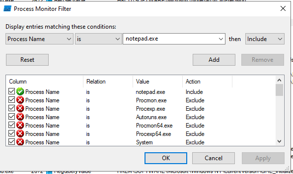
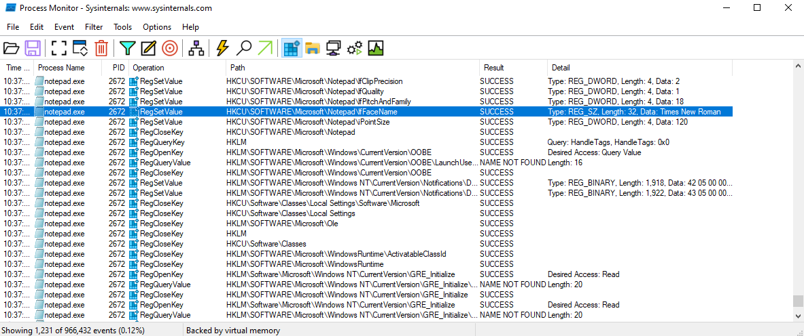
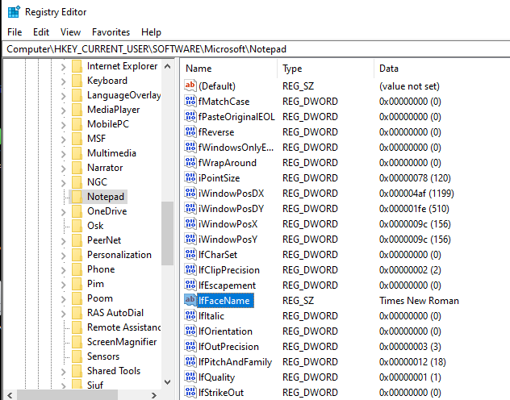

## Registry Internal

Describes how the configuration manager—the executive subsystem that implements the registry—organizes the registry’s on-disk files

### Hives

- On disk, the registry is a set of discrete file called hives. 
  -  Each hive contains a registry tree, which has a root key as the starting point of the tree. 
  -  Subkeys and their values reside beneath the root
- The path names of all hives except for user profiles are coded into the configuration manager: HKLM\SYSTEM\CurrentControlSet\Control\Hivelist

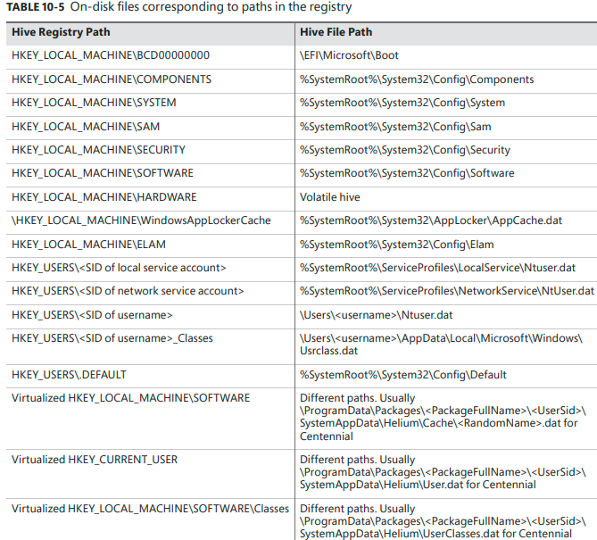

EXPERIMENT: Manually loading and unloading hives
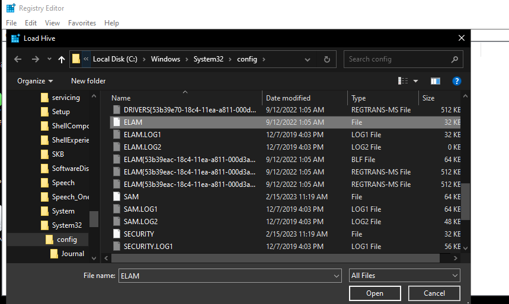
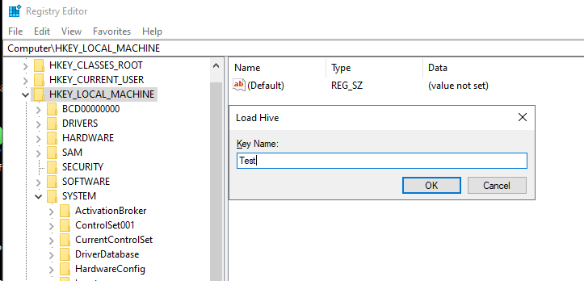

### Hive size limits

- Hive size are limited in some case, example HKLM\System.
- On 32-bit system, Winload allows the hive to be as large as 400MB or half of the amount of physical memory on the system, whichever is lower
- On x64 systems, the lower bound is 2 GB.

### Startup and the registry process

- The NT kernel initialization is a complex process that takes place when a computer running Windows starts up. This process is divided into two phases, phase 0 and phase 1.
- The Registry process is a fully-protected (WinSystem level), minimal process, which the configuration manager uses for performing most of the I/Os on opened registry hives. 
- At phase 1 of the NT kernel initialization: the Configuration manager startup routine initializes multiple components of the Registry: cache, worker threads, transactions, callbacks support, and so on. It then creates the Key object type, and, before loading the needed hives, it creates the Registry process. At initialization time, the configuration manager maps the preloaded hives in the Registry process.
-  The preloaded hives (SYSTEM and ELAM) continue to reside in nonpaged memory, though (which is mapped using kernel addresses). Later in the boot process, the Session
Manager loads the Software hive by invoking the NtInitializeRegistry system call.
- This method reduces the amount of committed virtual memory and guarantees that no more than 64 MB of working set is consumed by the registry, even in high memory pressure scenarios.
- The system also uses a copy-on-write operation when writing or modifying registry keys and values stored in a hive, and the actual pages belonging to the primary hive file are written later by the Reconciler, a lazy writer thread.

### Registry symbolic links

- A special type of key help the configuration manager to link keys to organize the registry. 
  - Invisible with Regedit (this value is REG_LINK instead of a REG_SZ)
  - Created by specifying the REG_CREATE_LINK parameter to RegCreateKey or RegCreateKeyEx. The configuration manager will create a REG_LINK value (contains the path to the target key)

EXPERIMENT: Looking at hive handles
  
### Hive structure

- The configuration manager divides a hive into `block`
  - The base registry block size is 4KB in 32-bit versions and 8KB in 64-bit versions. 
  - It will expands in block-granular increments if it new data expands a hive
  - Includes:
    - Global information about the hive
    - A signature *regf*  (Identify the file as a hive)
    - Two updated sequence numbers, a time stamp (Show the last time a write operations was intiated on the hive)
    - Information on registry repair or recovery performed by Winload
    - The hive format version number (The data format within the hive)
    - A checksum
    - The hive file's internal file
- `cell` is a container where stores the registry data of a hive:
  -  A cell can hold a key, a value, a security descriptor, a list of subkeys, or a list of key values
  - When a cells joins a hive and the hive must expand to contain the cell, the size of the new cell rounded up to the next block or page boundary called `bin` :
    - Contains a signature, hbin, a field that records the offset into the hive file of the bin and the bin's size.
    - Any space between the end of the cell and the end of the bin (free space) can allocate to other cells.
    - Using bins instead of cell to track active parts of the registry help Windows to minimizes some management chores
  - Table 10-6 Cell data types:
    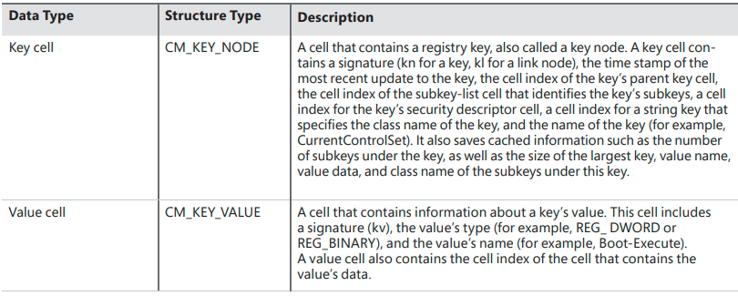
    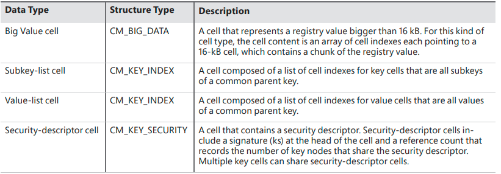

- The links that create the structure of a hive are called `cell indexes`
  - Offset of a cell into a hive file minus the size of the base block, like a pointer from one cell to a other cell that the configuration manager interprets relative to the start of a hive.

  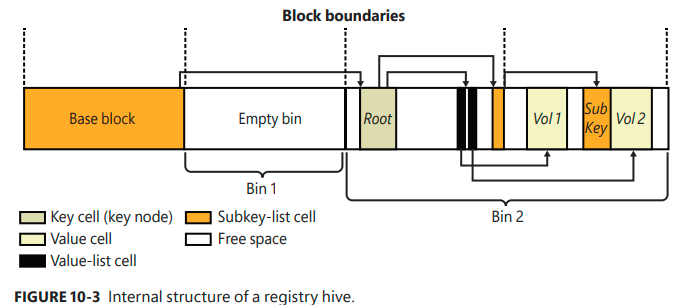

### Cell maps

- The hive using the mapped views in the registry process.
- While a cell index is only an offset in the hive file, the configuration manager employs a two-level scheme. 
    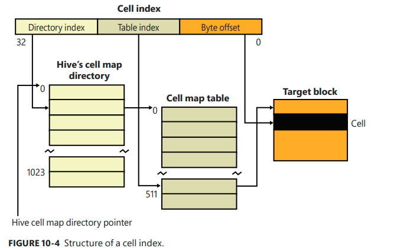
- When a hive initializes, the configuration manager dynamically creates the mappings tables, designating a map entry for each block in the hive, and it adds and deletes tables from the cell directory as the changing size of the
hive requires.

## Hive reorganization
- Every time the configuration manager mounts a hive file, it check whether a hive's reorganization needs to be performed. The configuration manager records the time of the last reorganization in the hive’s basic block. If the hive has valid log files, is not volatile, and if the time passed after the previous reorganization is greater than seven days, the reorganization operation is started
- The reorganization have two main goals : shrink the hive files and optimize it.
- Result of a reorganization is produces a nonfragmented hive file where each cell is stored sequentially in the bin, and new bins are always appended at the end of the file.
  - Result stored in HKLM\SYSTEM\CurrentControlSet\Control\SessionManager\Configuration Manager\Defrag

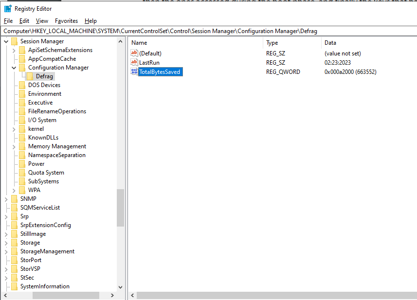

## The registry namespace and operation

- The configuration manager insert a key object named Registry into the root of the Windows namespace, which servers as the entry point to the registry.
- Each open Registry key have a `key control block`. 
  -  `Key control block` stores 
     -  Name of the key
     -  Cell index of the key node that the control block refers to
     -  A flag that notes whether the key will be delete when the last handle for the key closes
- Windows places all control blocks into a hash table to enable quick searches for existing key control blocks by name. 
  - A key project points to its corresponding key control block.
  

EXPERIMENT: Viewing key control blocks

## Stable storage

- Each nonvolatile hive have an associated log hive ( a hidden file with the same base name as the hive and a logN extension)
  - To ensure forward progress, the configuration manager uses a dual-logging scheme: *.log1*, *.log2*
- When a hive initialize, the configuration manager allocates a bit array called the `dirty sector array`, means that the system has modified the corresponding sector in the hive in memory and must write the sector back to the hive file.
- `dirty sector array`
  - A bit array in which each bit represents a 512-byte portion, or sector, of the hive.
  - When a bit in array is set, the corresponding sector in the hive has been modified in memory and needs to be written back to the hive file on disk 
  > `dirty sector` is a sector of storage that has been modified but but the changes have not been written to the permanent storage medium.
- `lazy flush` operation (`log sync`):
  - The hive lazy writer system wakes up 1 minutes after the request to synchronize the hive's log
  - Generates new log entries from the in-memory hive sectors referenced by valid bits of the dirty sectors array and writes them to the hive log files on disk.

### Incremental logging

- Cells in a hive file  can be in four differnet states:
  - *Clean* : data is in the hive's primary file and has not been modified 
  - *Dirty* : data has been modified but resides only in memory
  - *Unreconciled* : data has been modified and correctly written to a log file but isn’t in the primary file yet.
  - *Dirty and Unreconciled* : After the cell has been written to the log file, it has been modified again. Only the first modification is on the log file, whereas the last one resides in memory only
- Summary synchronization algorithm: 
  1. The configuration manager writes all the modified cells signaled by the dirty vector in a single
entry in the log file.
  2. It invalidates the hive’s base block (by setting only one sequence number with an incremented
value than the other one).
  3. It writes all the modified data on the primary hive’s file.
  4. It performs the validation of the primary hive (the validation sets the two sequence numbers
with an identical value in the primary hive file).

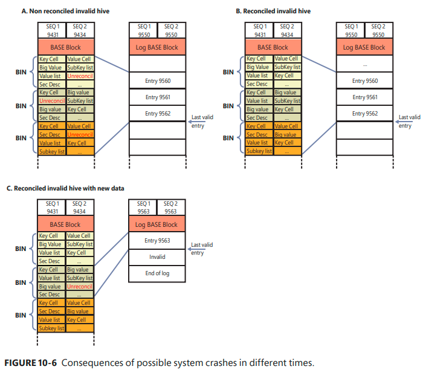

## Registry filtering

- Allows for monitoring of registry activity by tools such as Process Monitor.
- Windows registry Callbacks model

## Registry virtualization

## Registry optimizations

----------------------
## Some demo

**Breaking windows via editing registry **

Delete HKEY_LOCAL_MACHINE\SYSTEM\Setup and restart, we will see blue screen.
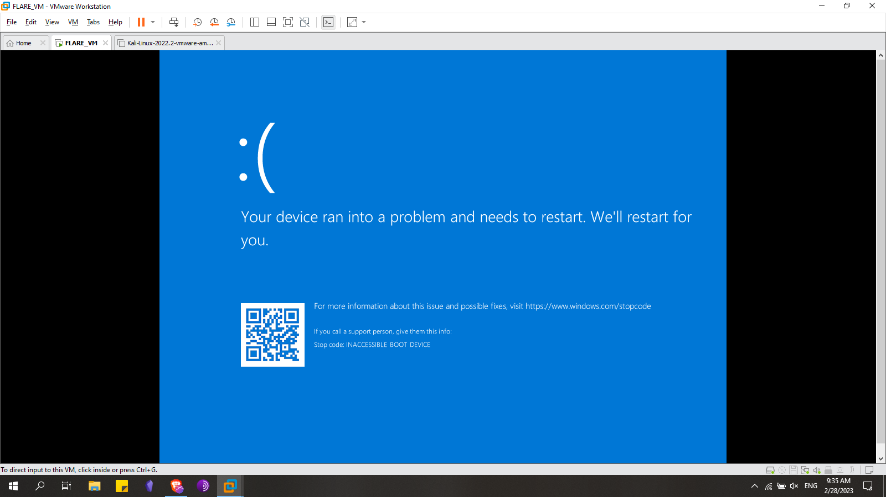

